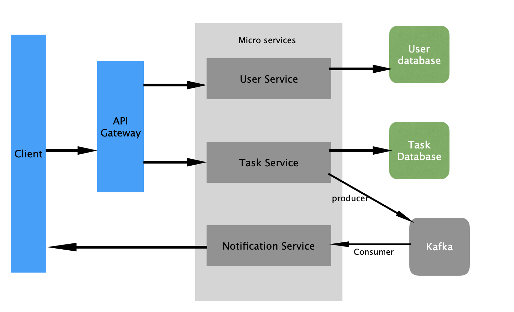
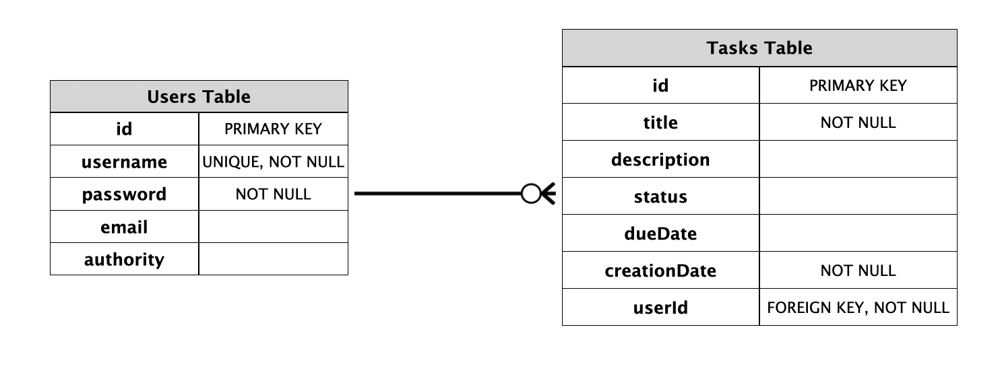
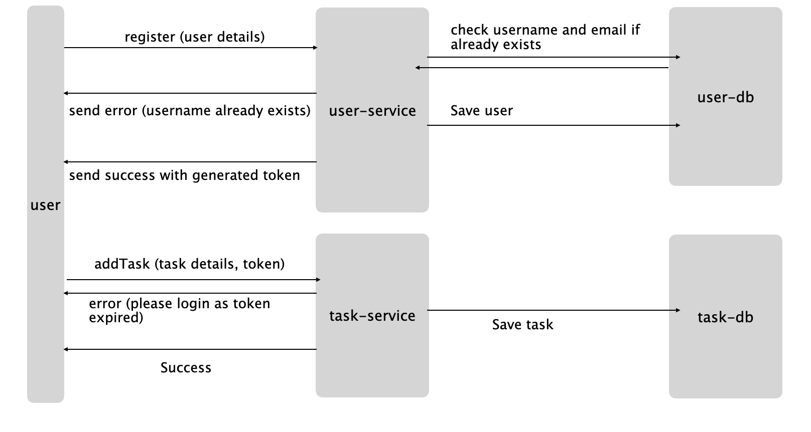

   **- > Steps to run the application:**

Prerequisites: Docker desktop, maven.

1. Download the repository.

2. Build all the microservices and run the app using docker-compose. This is done using ./start-all.sh script which creates the network and set the container dependencies based on the config mention in the docker-compose.yml and env. 
   This will build all the jar files and run all the services.
   ```
      ./start-all.sh
   ```
3. To test apis, import postman api collection from 
   ```
      ./docs/postman_collection.json.
   ```

4. Register user with username, password and emailId. Access token will be returned in response, pass this token as bearer token in postman to access other apis.
5. Use http://localhost:5050/browser/ to manage user-database or task-database on pgAdmin. Refer configurations from docker-compose.yaml to add server on pgAdmin.


 **- > Feature:**

1. Functional

   - User Management: user can register, login, update, delete, fetch user details using rest apis. User authenticated using access-token.
   - Task Management: user can create, update, delete, fetch or mark task as complete. User can fetch all tasks by userid.
   - Notification: send communication when task created, updated or completed.

2. Non-Functional

   - There are three microservice container named user-service, task-service and notification-service.
   - Separate postgres database container for user-database and task-database.
   - Separate container for pgadmin and kafka.
   - Use ./.evn and ./docker-compose.yaml file to manage configurations.
   - Run ./start-all.sh to build services and run all containers on docker.
   - Run ./stop-all.sh to stop all containers on docker.
   - Tools & Frameworks - Spring Framework, Postgres, PgAdmin, Docker, Kafka, Postman, lombok, Intellij.
   - Grafana cloud extension on docker desktop is used to monitor servers.


**- > High-Level Diagrams & Documentation:**

1. Architecture Diagram:
   
2. Database Schema:
   
3. Sequence Diagram:
   
4. Deployment Diagram
   - Please run ./start-all.sh to start all servers.
5. Design Choices Documentation:
   - The microservices architecture allows for independent development, deployment, and scaling of each service. It enhances fault isolation, making the system more resilient to failures. Each service can be scaled independently based on its load, ensuring better resource utilization.
   - Design services to be stateless: Stateless services simplify horizontal scaling as they do not rely on local session state.
   - Use Kafka for communication between microservices: Kafka provides a robust, distributed messaging system that ensures reliable communication between microservices. It supports asynchronous communication, which enhances decoupling and resiliency. Kafka's partitioning allows the notification service to scale by processing messages in parallel.
   - Spring Security with JWT: JSON Web Tokens provide a stateless authentication mechanism, which is well-suited for microservices.
   - Postgres: Postgres is chosen for its robust features and performance. One database per mirco services is created for now which can horizontally distributed on the basis of userId.
   - Use DTOs for data transfer: DTOs help encapsulate data sent over the network, reducing the risk of exposing internal implementation details.